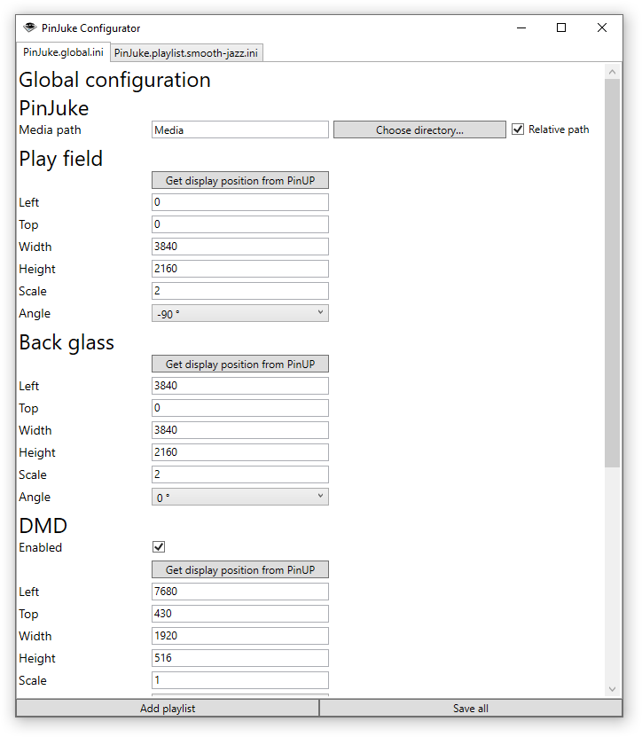
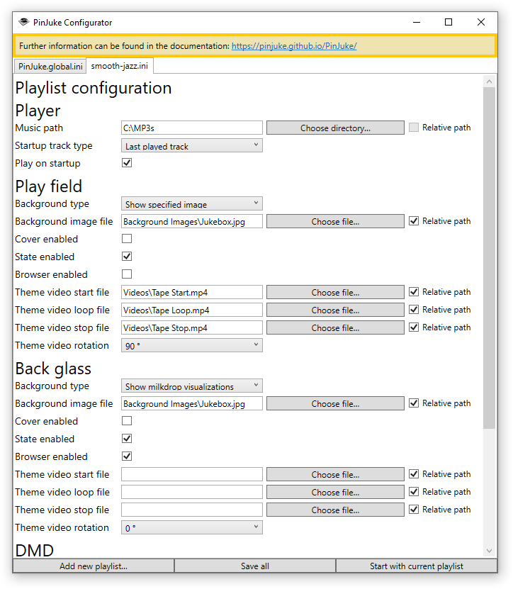

- [Start](index.md)
- [Features](FEATURES.md)
- [Installation](INSTALLATION.md)
- [Configuration](CONFIGURATION.md)
- [Theme videos](THEME-VIDEOS.md)
- [Run a playlist file](RUN.md)
- [Controls](CONTROLS.md)
- [Pinup Popper](PINUP-POPPER.md)
- [FAQ](FAQ.md)

# Configuration

The configuration of PinJuke music player is saved in via ini files.

The configuration is split into a **global** configuration ini file and a **playlist** configuration ini file. You can have multiple **playlist** configuration ini files, but PinJuke music player will use a single **playlist** configuration ini file at a time. (See how to [run the app using a playlist file](RUN.md).)

## Global configuration

The global configuration should specify information about your cabinet setup e.g. the placement and the size of your displays or the key bindings.

## Playlist configuration

The playlist configuration should specify information about your music library e.g. the path to the root folder of your music library or background images.

## Creating the required configuration ini files

The PinJuke Configurator UI assists you in creating and editing the configuration files. Start the Configurator by just starting `PinJuke.exe`.

Add at least one **playlist** configuration. If you agree with the entries you have made, click the `Save all` button at the bottom to write the ini files.

## Manual editing

If you ever want to edit the configuration manually, you can do so by using a text editor like *Notepad*.

The zip archive ships with a sample ini file for **global** and **playlist** configuration respectively.

- Copy `Templates\PinJuke.global.sample.ini` to `Configs\PinJuke.global.ini`.
- Copy `Templates\PinJuke.playlist.sample.ini` to `Configs\Playlists\PinJuke.playlist.ini` (You can freely choose the file name of the playlist e.g. `smooth-jazz.ini`).
