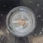
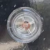
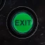

- [Start](index.md)
- [Features](FEATURES.md)
- [Installation](INSTALLATION.md)
- [Setup Wizard](ONBOARDING.md)
- [Configuration](CONFIGURATION.md)
- [Theme Video Clips](THEME-VIDEOS.md)
- [Controls](CONTROLS.md)
- [Run a Playlist File](RUN.md)
- [Pinup Popper](PINUP-POPPER.md)
- [FAQ](FAQ.md)

# Keyboard Controls

| Button | | Default Key Mapping | Regular Function | Browser is Visible |
|--------|-|---------------------|------------------|--------------------|
|  | Flipper button left/right | Left shift/right shift | Track back/forward | Navigate back/forward |
|  | Magna save button left/right | Left ctrl/right ctrl | Volume down/up | Visualization back/forward |
|  | Start button | 1 | Play/pause | Play/pause |
|  | Exit button | Escape | Exit app | Exit app |
|  | Launch ball button | Enter | Open track browser | Folder: follow Track: restart |
