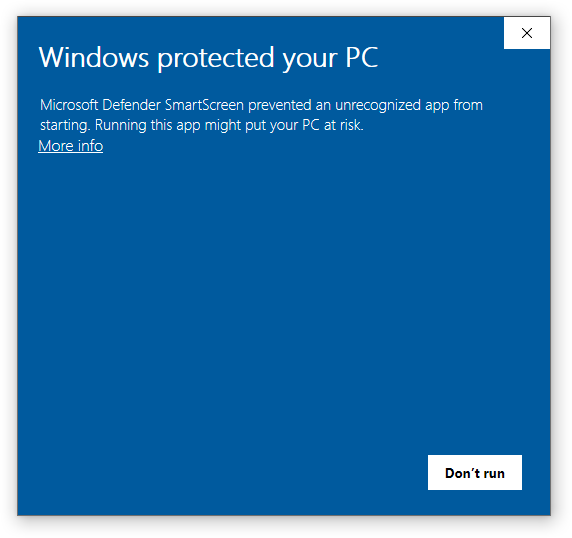
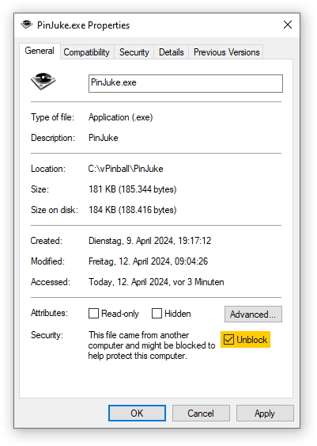
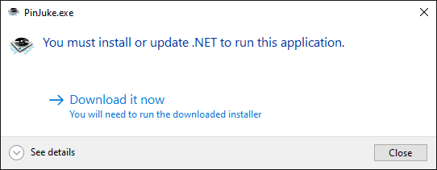

- [Start](index.md)
- [Features](FEATURES.md)
- [Installation](INSTALLATION.md)
- [Configuration](CONFIGURATION.md)
- [Theme videos](THEME-VIDEOS.md)
- [Run a playlist file](RUN.md)
- [Controls](CONTROLS.md)
- [Pinup Popper](PINUP-POPPER.md)
- [FAQ](FAQ.md)

# Installation

## Download

Head over to the [releases page](https://github.com/PinJuke/PinJuke/releases) to download the latest *application*.

You may also want to download the
- [PinJuke Milkdrop assets](https://github.com/PinJuke/PinJuke-Milkdrop/releases) for the visualizer
- [PinJuke Media assets](https://github.com/PinJuke/PinJuke-Media/releases) containing some [theme videos](THEME-VIDEOS.md)

## Extract the archives

The zip archives contain a top level `PinJuke` folder so you can extract the files for example to `C:\vPinball` (the default location of the *PinUP Popper Baller Installer*).

If you extract the zip archive using the archiver software integrated in Windows you probably get a hint, when you want to run the application:

To solve this, open the context menu by right clicking `PinJuke.exe`. Click on properties. Here you can unblock the prevention of the execution. Check the appropriate box labeled `Unblock` and click OK:

## Install the .NET runtime

If you run PinJuke for the first time it is likely that you need to install the .NET runtime. You may see a message box that takes you to Microsoft's .NET download website:

