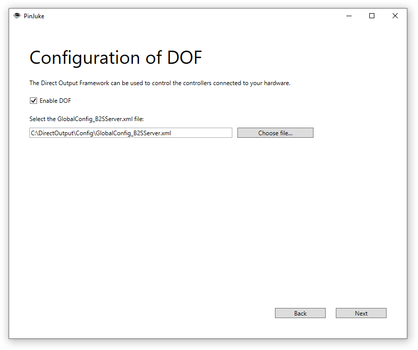

- [Start](index.md)
- [Features](FEATURES.md)
- [Installation](INSTALLATION.md)
- [Setup Wizard](ONBOARDING.md)
- [Configuration](CONFIGURATION.md)
- [Theme Video Clips](THEME-VIDEOS.md)
- [Controls](CONTROLS.md)
- [Run a Playlist File](RUN.md)
- [Pinup Popper](PINUP-POPPER.md)
- [FAQ](FAQ.md)

# Setup Wizard

On first launch, PinJuke music player welcomes you with the Setup Wizard.

These are the steps of the Setup Wizard:

