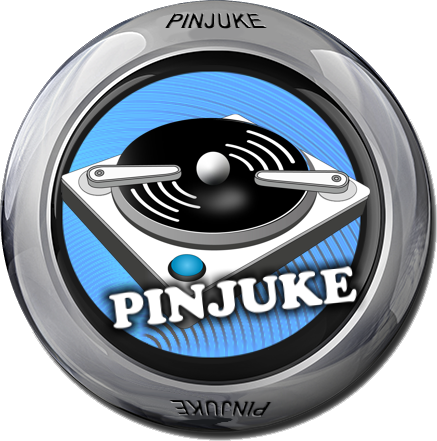

- [Start](index.md)
- [Features](FEATURES.md)
- [Installation](INSTALLATION.md)
- [Setup Wizard](ONBOARDING.md)
- [Configuration](CONFIGURATION.md)
- [Theme Video Clips](THEME-VIDEOS.md)
- [Controls](CONTROLS.md)
- [Run a Playlist File](RUN.md)
- [Pinup Popper](PINUP-POPPER.md)
- [FAQ](FAQ.md)


# Pinup Popper

PinJuke music player is designed for integration into *Pinup Popper*.

Before you proceed, make sure you've added at least one *playlist* configuration to PinJuke music player.

Use the *PinUP Popper Config* tool to add a new emulator and create a playlist entry in *Pinup Popper*:

## Add an Emulator

In the *Popper Setup* tab click the *Emulators* button, then the *+* button.

### *General* tab

| Field | Value |
|-------|-------|
| Emulator Display Name | PinJuke |
| Description | Pinball Cabinet Jukebox |
| EMU Name | PinJuke |
| Launch EXE Folder | C:\vPinball\PinJuke |
| Games Folder | C:\vPinball\PinJuke\Configs\Playlists |
| Games File Extension | ini |
| Roms Folder | |
| Media Dir | C:\vPinball\PinUPSystem\POPMedia\PinJuke |

### *Launch Setup* tab

#### Launch Script

```
START "" "[STARTDIR]Launch\VPXStarter.exe" 3 2 30 "PinJuke PlayField"
CD /D "[DIREMU]"
START "" PinJuke.exe "[DIRGAME]\[GAMENAME][GAMEEXT]"
```

#### Close Script

```
"[STARTDIR]Launch\PuPCloser.exe" WINTIT "PinJuke PlayField" 10 1
```

### Save

Save your emulator. The **EMUID** is displayed on the right side. Remember it for the playlist SQL query later.

## Scan for New Games

Return to *PinUP Popper Setup*. In the *Game Manager* tab click the *Games Manager* button.

### *Add New Games* tab

- Select *PinJuke* from the *Scan Filter Emulator* dropdown.
- Click the *Scan For New Games* button.
- Select your games (PinJuke playlist ini files) from the list.
- Click the *Add Games to System* button.

## Create a Playlist

Return to *PinUP Popper Setup*. In the *Game Manager* tab click the *PlayList Config* button.

- Select the *PlayLists Home* root node.
- Click the *Add New Playlist* button and name the new playlist e.g. "PinJuke".
- In the *Settings* tab
  - Check the *Playlist is Active SQL Query* checkbox.
  - Paste into the *Active SQL Command* text field:
    ```SQL
    SELECT * FROM Games WHERE EMUID = 7 AND Visible = 1 ORDER BY GameDisplay
    ```
    Make sure to adjust the query to incorporate your **EMUID** (replace the `7`)!

## Media Files

Return to *PinUP Popper Setup*. In the *Game Manager* tab click the *Media Manager* button.

- Select the *PlayLists* for the *Type* radio button group.
- Select your playlist from the list.
- Drag and drop the png for the WheelImage.
- Replace the file `C:\vPinball\PinUPSystem\POPMedia\PinJuke\System\pup_default.png`

### Wheel Images




