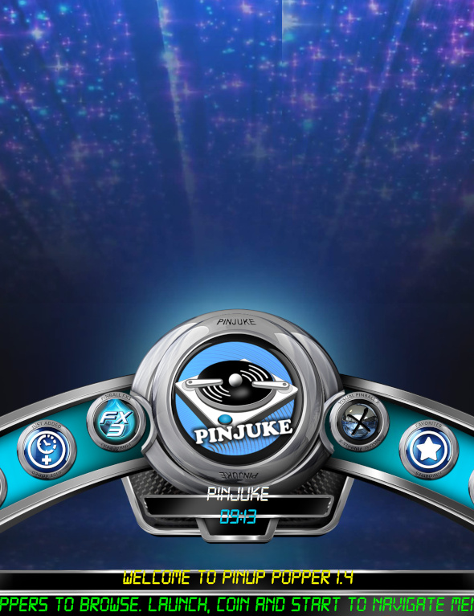
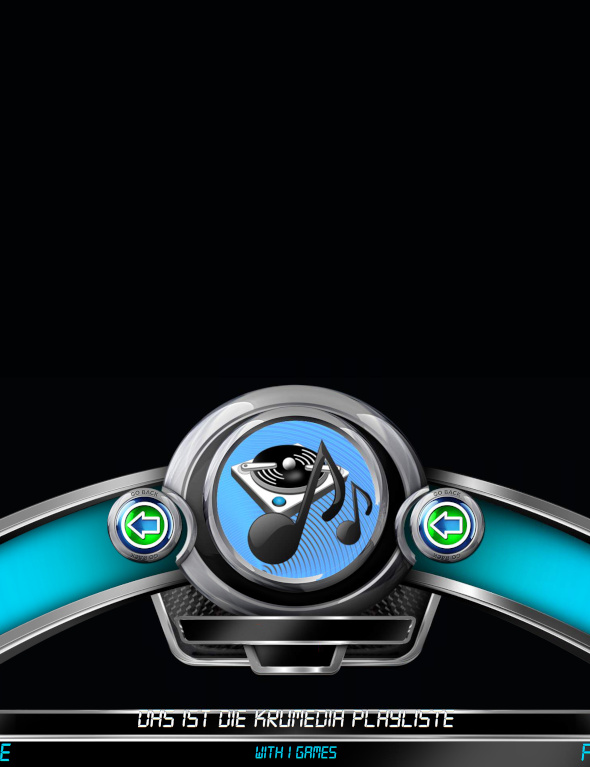

- [Start](index.md)
- [Features](FEATURES.md)
- [Installation](INSTALLATION.md)
- [Configuration](CONFIGURATION.md)
- [Theme videos](THEME-VIDEOS.md)
- [Run a playlist file](RUN.md)
- [Controls](CONTROLS.md)
- [Pinup Popper](PINUP-POPPER.md)
- [FAQ](FAQ.md)

# Pinup Popper

PinJuke is prepared to get integrated in *Pinup Popper*. To achieve this, you need to create a new *Emulator* entry and point the *Games Folder* to `Configs\Playlists` (e.g. `C:\vPinball\PinJuke\Configs\Playlists`).

(More to be written here.)

