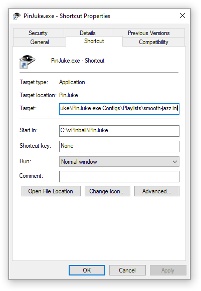

- [Start](index.md)
- [Features](FEATURES.md)
- [Installation](INSTALLATION.md)
- [Configuration](CONFIGURATION.md)
- [Theme videos](THEME-VIDEOS.md)
- [Run a playlist file](RUN.md)
- [Controls](CONTROLS.md)
- [Pinup Popper](PINUP-POPPER.md)
- [FAQ](FAQ.md)

# Run the app using a playlist file

To run PinJuke music player using an existing **playlist** configuration ini file and to skip the PinJuke Configurator you have to pass the path of the playlist e.g. `PinJuke.exe Configs\Playlists\smooth-jazz.ini`.

You may create a shortcut via context menu of `PinJuke.exe` and then edit the target:

Passing the **playlist** file to the app allows integration into the [Pinup Popper](PINUP-POPPER.md) software.
