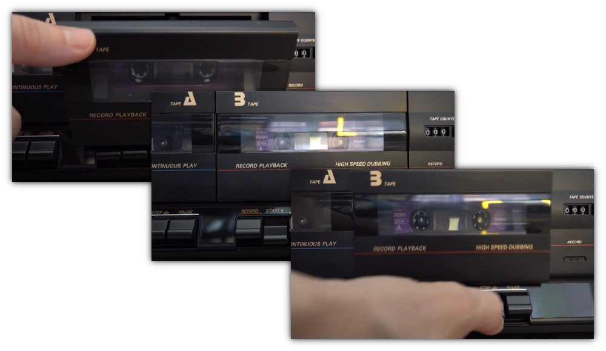

- [Start](index.md)
- [Features](FEATURES.md)
- [Installation](INSTALLATION.md)
- [Configuration](CONFIGURATION.md)
- [Theme videos](THEME-VIDEOS.md)
- [Run a playlist file](RUN.md)
- [Controls](CONTROLS.md)
- [Pinup Popper](PINUP-POPPER.md)
- [FAQ](FAQ.md)

# Theme videos

You can define *theme videos* that are played when the current track starts, plays or stops.

