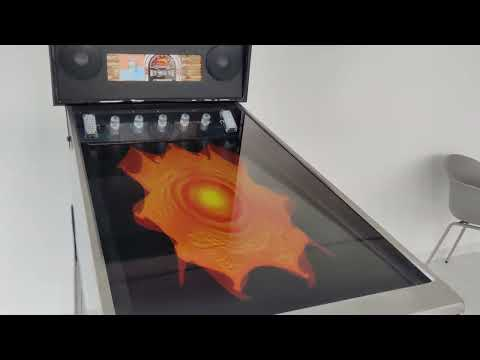
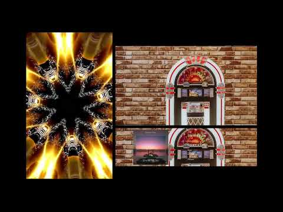

- [Start](index.md)
- [Features](FEATURES.md)
- [Installation](INSTALLATION.md)
- [Setup Wizard](ONBOARDING.md)
- [Configuration](CONFIGURATION.md)
- [Theme Video Clips](THEME-VIDEOS.md)
- [Controls](CONTROLS.md)
- [Run a Playlist File](RUN.md)
- [Pinup Popper](PINUP-POPPER.md)
- [FAQ](FAQ.md)

# PinJuke music player

A music player tailor-made for virtual pinball cabinets.

## See it in action

Watch the software running live on a virtual pinball cabinet (link to YouTube):

Watch a screen recording of the three displays Play field, Back glass and DMD (link to YouTube):

